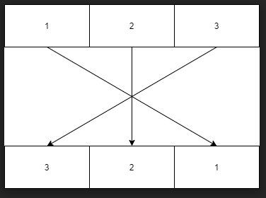
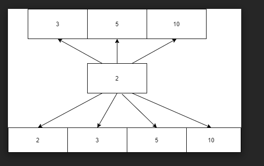
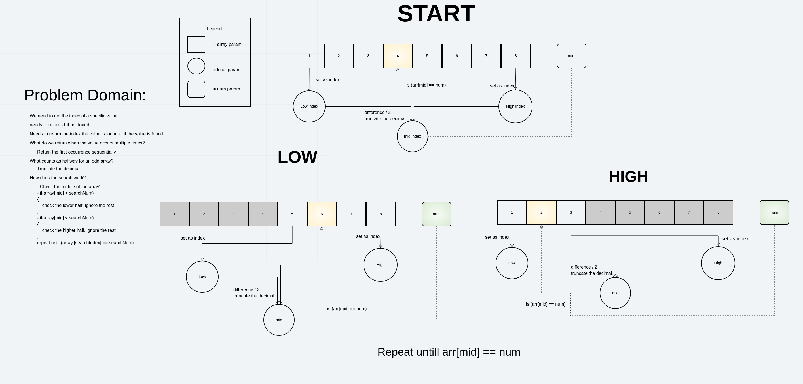
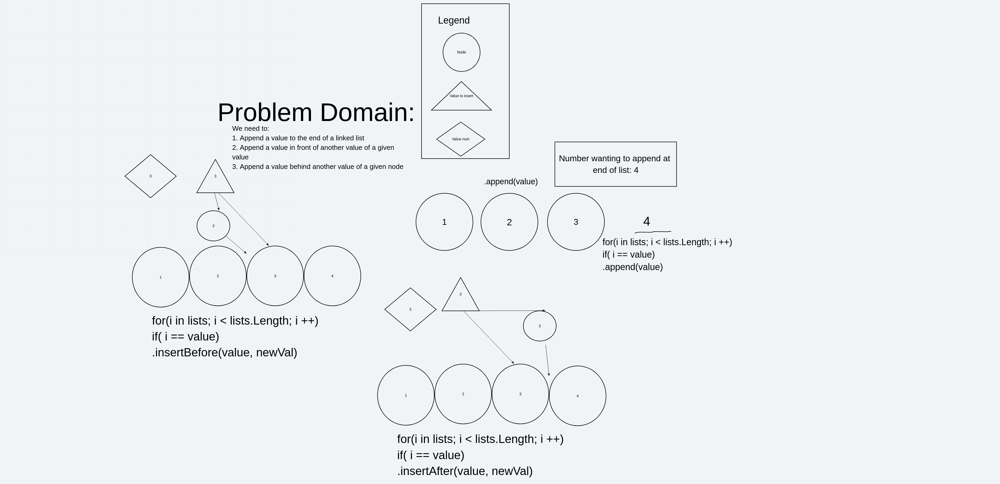
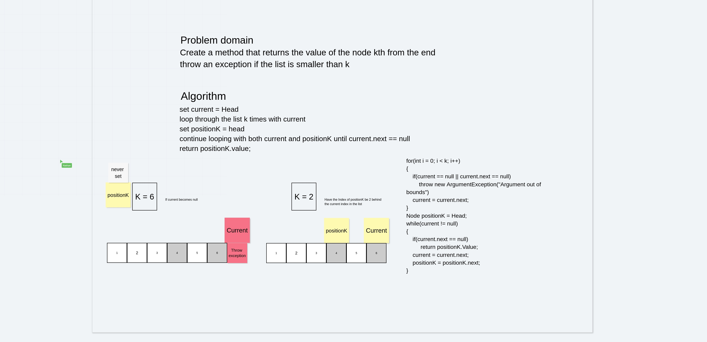
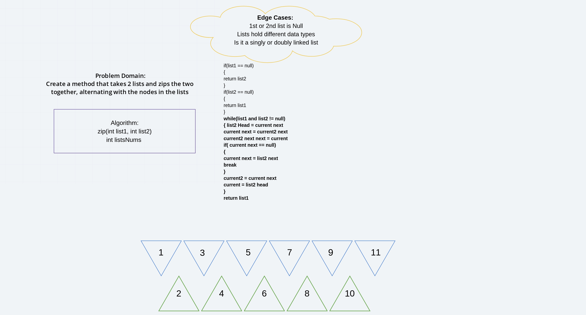
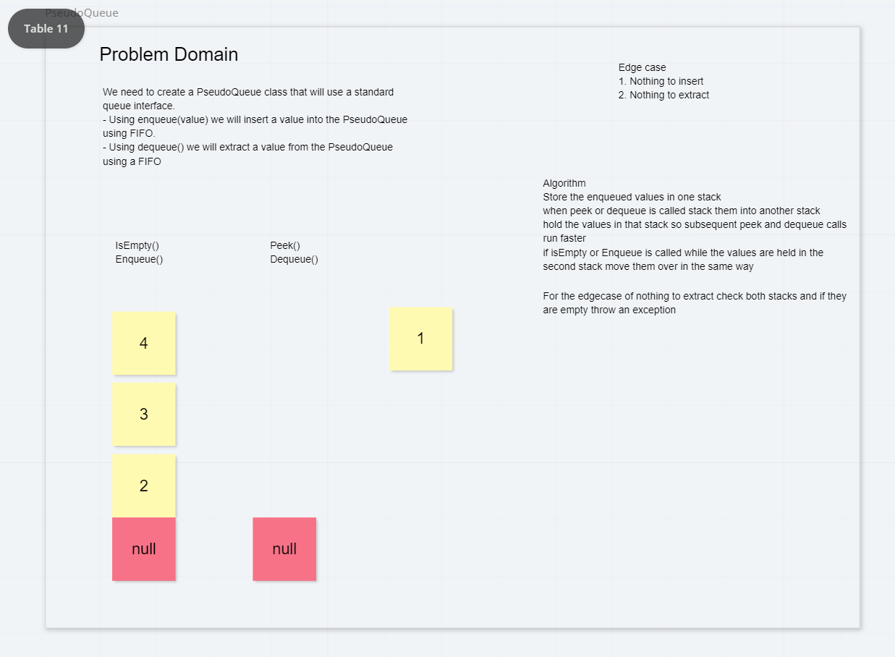
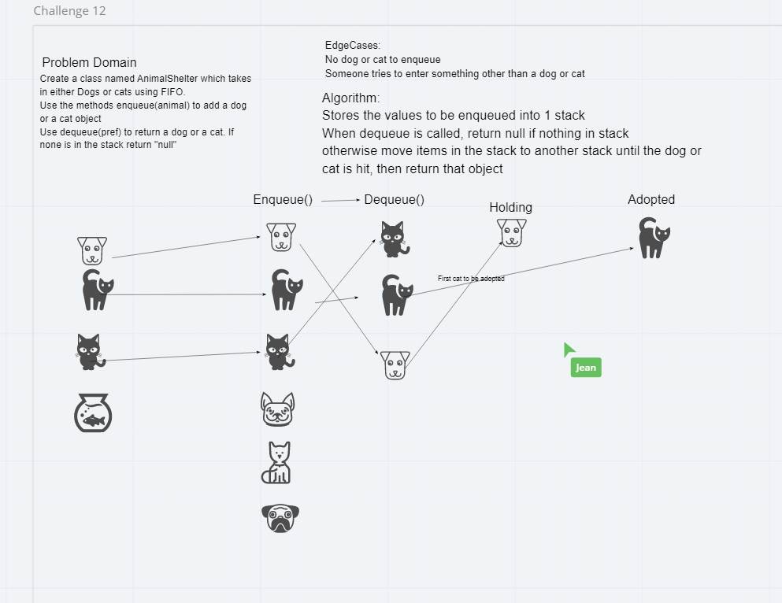

# 401-data-structures-and-algorithms
Links to Tests:   
[Array Challenge Tests](https://github.com/Kozer2/401-data-structures-and-algorithms/tree/main/CHallenges.Tests/ArrayChallenges)  
[Pseudo Queue Tests](https://github.com/Kozer2/401-data-structures-and-algorithms/tree/main/CHallenges.Tests/PseudeoQueueTests)  
[Linked List Tests](https://github.com/Kozer2/401-data-structures-and-algorithms/tree/main/DataStructures.Tests/LinkedLists)  
[Stack and Queue Tests](https://github.com/Kozer2/401-data-structures-and-algorithms/tree/main/DataStructures.Tests/StackNQueuesTests)  

# Reverse an Array
This console app takes an array of an indeterminate length and then reverses it and returns it back to the user. 

## Challenge
For this code challenge we were told to write a method that would take an array and return it reversed.

## Approach & Efficiency
Our solution increases linearly as the array length increases. It is O^n.

## Solution
We went as simple as we could. Here is a picture of our whiteboard.

# Insert Shift Array
This function takes a given input number and inserts it into the middle point of an array.

## Challenge
Write a function called insertShiftArray which takes in an array and the value to be added. Without utilizing any of the built-in methods available to your language, return an array with the new value added at the middle index.

## Approach & Efficiency
Our solution increases linearly as the array length increases. It is O n

## Solution
Our solution to this was to find and store the middle of the array and then compare the numbers in the array to that variable. Once it was larger than a number in the array we inserted the given number. 

# Binary Array Search
This function uses binary search to sort through arrays

## Challenge
Write a function called BinarySearch which takes in 2 parameters: a sorted array and the search key. Without utilizing any of the built-in methods available to your language, return the index of the array’s element that is equal to the search key, or -1 if the element does not exist.

## Approach & Efficiency
We looked at this with O(log n) and knew we needed to find the small starting number, the max number, and the mid. 

## Solution
To find the mid Number I took the max number, added the minimium to it and then divided them by 2.

# Singly Linked List
Working with Linked Lists create basic tests that insert to Linked Lists. 

## Challenge
Create a Node class that has properties for the value stored in the Node, and a pointer to the next Node.
Within your LinkedList class, include a head property. Upon instantiation, an empty Linked List should be created.
Define a method called insert which takes any value as an argument and adds a new node with that value to the head of the list with an O(1) Time performance.
Define a method called includes which takes any value as an argument and returns a boolean result depending on whether that value exists as a Node’s value somewhere within the list.
Define a method called toString (or __str__ in Python) which takes in no arguments and returns a string representing all the values in the Linked List, formatted as:
"{ a } -> { b } -> { c } -> NULL"
Any exceptions or errors that come from your code should be semantic, capturable errors. For example, rather than a default error thrown by your language, your code should raise/throw a custom, semantic error that describes what went wrong in calling the methods you wrote for this lab.
Be sure to follow your language/frameworks standard naming conventions (e.g. C# uses PascalCasing for all method and class names).

## Approach & Efficiency
Big On

# Linked List
Work over Linked Lists

## Challenge
Write the following methods for the Linked List class:

.append(value) which adds a new node with the given value to the end of the list
.insertBefore(value, newVal) which add a new node with the given newValue immediately before the first value node
.insertAfter(value, newVal) which add a new node with the given newValue immediately after the first value node

## Approach & Efficiency

## Solution

# Challenge Summary
We need to write a method with associated tests that takes a number, K, and returns what is at that position in the list.

## Challenge Description
Write a method for the Linked List class which takes a number, k, as a parameter. Return the node’s value that is k from the end of the linked list. You have access to the Node class and all the properties on the Linked List class as well as the methods created in previous challenges.

## Approach & Efficiency
The Big O for this is On

## Solution

# Challenge Summary
Our challenge for today is to write a method that will take 2 linked lists and zip them together without making a new list.

## Challenge Description
Write a function called zipLists which takes two linked lists as arguments. Zip the two linked lists together into one so that the nodes alternate between the two lists and return a reference to the head of the zipped list. Try and keep additional space down to O(1). You have access to the Node class and all the properties on the Linked List class as well as the methods created in previous challenges.

## Approach & Efficiency
We want to keep it close to Big On

## Solution

# Stacks and Queues
Write methods that will add to a stack and show proper queuing

## Challenge
Create a Node class that has properties for the value stored in the Node, and a pointer to the next node.  
Create a Stack class that has a top property. It creates an empty Stack when instantiated.  
This object should be aware of a default empty value assigned to top when the stack is created.  
Define a method called push which takes any value as an argument and adds a new node with that value to the top of the stack with an O(1) Time performance.  
Define a method called pop that does not take any argument, removes the node from the top of the stack, and returns the node’s value.  
Should raise exception when called on empty stack  
Define a method called peek that does not take an argument and returns the value of the node located on top of the stack, without removing it from the stack.  
Should raise exception when called on empty stack  
Define a method called isEmpty that takes no argument, and returns a boolean indicating whether or not the stack is empty.

Create a Queue class that has a front property. It creates an empty Queue when instantiated.  
This object should be aware of a default empty value assigned to front when the queue is created.  
Define a method called enqueue which takes any value as an argument and adds a new node with that value to the back of the queue with an O(1) Time performance.  
Define a method called dequeue that does not take any argument, removes the node from the front of the queue, and returns the node’s value.  
Should raise exception when called on empty queue  
Define a method called peek that does not take an argument and returns the value of the node located in the front of the queue, without removing it from the queue.  
Should raise exception when called on empty queue  
Define a method called isEmpty that takes no argument, and returns a boolean indicating whether or not the queue is empty.  

Be sure to follow your languages best practices for naming conventions.  
You have access to the Node class and all the properties on the Linked List class.

## Approach & Efficiency
The Stack should be Big O(1)

## API
Check StacksAndQUeuesTests 

# Challenge 11
# Challenge Summary
Create a new class and using enqueue() and dequeue() add and pop values from a stack

## Challenge Description
Feature Tasks
Create a brand new PseudoQueue class. Do not use an existing Queue. Instead, this PseudoQueue class will implement our standard queue interface (the two methods listed below), but will internally only utilize 2 Stack objects. Ensure that you create your class with the following methods:

enqueue(value) which inserts value into the PseudoQueue, using a first-in, first-out approach.
dequeue() which extracts a value from the PseudoQueue, using a first-in, first-out approach.
The Stack instances have only push, pop, and peek methods. You should use your own Stack implementation. Instantiate these Stack objects in your PseudoQueue constructor.

## Approach & Efficiency
This is Big O^2

## Solution

# Challenge 12
# Challenge Summary
Using Enqueue() and Dequeue() populate an AnimalShelter and remove dogs or cats on a FIFO basis. 

## Challenge Description
Create a class called AnimalShelter which holds only dogs and cats. The shelter operates using a first-in, first-out approach.
Implement the following methods:
enqueue(animal): adds animal to the shelter. animal can be either a dog or a cat object.
dequeue(pref): returns either a dog or a cat. If pref is not "dog" or "cat" then return null.

## Approach & Efficiency
This is Big O^2

## Solution
